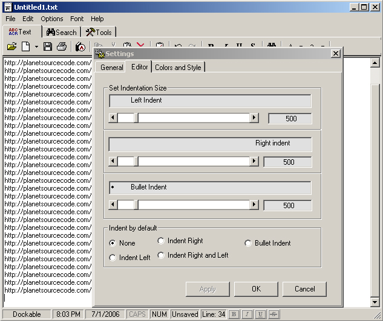



## Full\-of features, fully\-functional TextPad

### Description

TextPad is a step between MSWord and a notepad. (Actually, its a few steps up from notepad). Some included features are: spell check, auto-capatalization of first character in a sentence, 'Options' page that gets stored in the registry, interchangable fonts, font size, back/foreground colors, clock along with a timer and an alarm, calendar, 'Always-On-Top' feature, cut-copy-paste along with 'Special cut/copy' as well as 'Private cut/copy', text-search/replace, calculator and more. Everything was tested and it seems to work as planned, but if you find any errors, please email me. Another thing, the project contains a total of 18 forms, but most of them are relatively small, so when compiled, its not slow, loads at approx. same speed as notepad. (*I know I probably could've reused some forms, oh , well*). Check it out and let me know what you think... ATTN: The FONTS change from toolbar is fixed. Font Change from toolbar is only for selected text. If you have any questions, please ask before assuming that something doesn't function proerly, I will gladly answer. Thanx

----

P.S. Latest fix: I am resubmitting the textpad, now it will warn user if the filesize is bigger then it can handle, (I tested it at 2 mb, it worked fine. On 4mb it froze). Also, I updated the code so that you can open it using 'Open With' method and it will display the name of the file as well as contents. Try it out, compile it, save the exe file to a known location, then right-click the file you want to view and choose open-with. then click browse, go to location of the textPad.exe file, and click OK. That will open your textfile with my program...

----

Yet another fix...

I am sorry this code keeps popping up as new, but dew to all the comments and emailed suggestions, I decided to make this a prfect app.

---7-23-2006:

* Search Function bug has been fixed.

* WordSpell interface was changed.

* Cut/Copy, Special Cut/Copy,Private Cut/Copy, Paste and Private Paste remain disabled/enabled when neccesarry(In the menu and popup menu). I used mnuEdit_Click or HidenMenu_Click event to check the status of the clipboard/PrivateClipboard, and display proper menus.
 
### More Info
 

             |
---                |---
**Submitted On**   |2006-07-23 04:10:00
**By**             |[Serge\_G](https://github.com/Planet-Source-Code/PSCIndex/blob/master/ByAuthor/serge-g.md)
**Level**          |Beginner
**User Rating**    |4.8 (29 globes from 6 users)
**Compatibility**  |VB 5\.0, VB 6\.0
**Category**       |[Complete Applications](https://github.com/Planet-Source-Code/PSCIndex/blob/master/ByCategory/complete-applications__1-27.md)
**World**          |[Visual Basic](https://github.com/Planet-Source-Code/PSCIndex/blob/master/ByWorld/visual-basic.md)
**Archive File**   |[Full\-of\_fe2008217232006\.zip](https://github.com/Planet-Source-Code/serge-g-full-of-features-fully-functional-textpad__1-65789/archive/master.zip)

